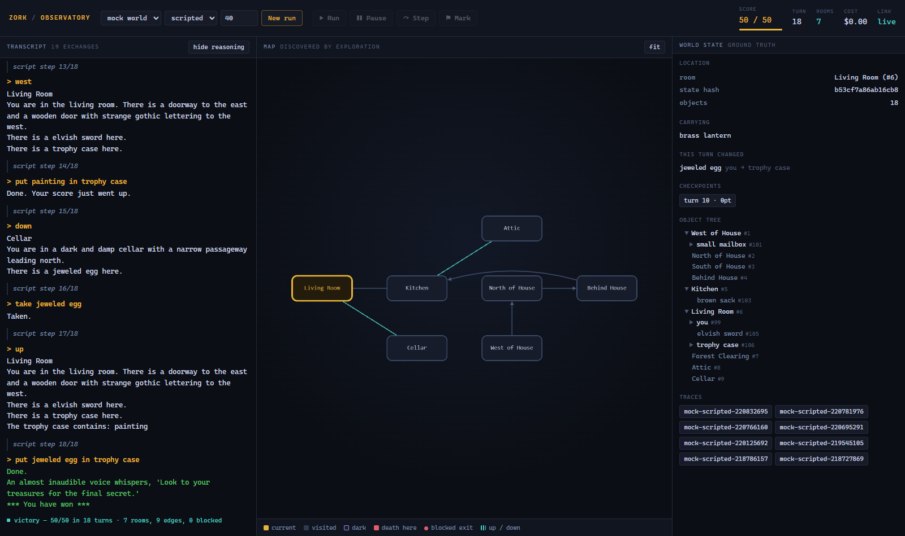

# Zork Observatory

An instrument for watching agents play interactive fiction.

The game runs unmodified. The observatory sits beside it and renders what is
normally invisible: the map being discovered turn by turn, the engine's internal
object tree changing under each command, and — when an LLM is playing — what the
model believed it was doing at the moment it acted.



## Why

Interactive fiction is an unusually good testbed for agents. The world is
symbolic, deterministic, and has ground truth: at any moment you can ask the
engine exactly where every object is. That makes claims falsifiable in a way
most agent benchmarks aren't.

The design decision that shapes everything else is that **game state is
serializable**. A playthrough isn't a line, it's a tree you can fork at any
turn — so "what if the agent had taken the lamp first" is a button, not a
rerun.

## Quick start

```bash
uv venv && uv pip install -e ".[dev]"

# Terminal: watch a scripted run through the built-in test world. No ROM, no API key.
observatory play --agent scripted --turns 30

# Browser: the full instrument.
observatory serve          # → http://127.0.0.1:8000
```

Then pick an engine and an agent in the top bar and press **Run**.

### Playing real games

`MockEngine` is a small hand-built world used for tests and for developing the
UI. Real Z-machine games run through [Jericho](https://github.com/microsoft/jericho),
which wraps a modified Frotz and exposes the live object tree, `get_state` /
`set_state`, and a world-state hash.

Jericho ships a compiled Frotz and is effectively Linux-only:

```bash
docker compose up --build       # → http://127.0.0.1:8000
```

Game files are **not** included — Zork is copyrighted. Put your own `.z5` in
`roms/` (mounted into the container) and select the Jericho engine with that
path.

```bash
observatory play --engine jericho --rom roms/zork1.z5 --agent claude --turns 100
```

### Playing with Claude

```bash
export ANTHROPIC_API_KEY=sk-ant-...        # or: ant auth login
observatory play --agent claude --turns 40 --trace traces/run.jsonl
```

The agent sees the transcript and nothing else — no object tree, no valid-action
list, no walkthrough. `--effort` (default `medium`) and `--history-turns`
(default 30) are the two cost levers; both are exposed in the UI.

`--info-level` controls how much it is told before it starts, from a bare
terminal to an openly coached player:

```bash
observatory play --agent claude --info-level cold --turns 60
```

## How it fits together

```text
        ┌──────────────┐
        │    Agent     │  sees only the transcript
        └──────┬───────┘
               │ command
        ┌──────▼───────┐
        │   Session    │  turn loop, map builder, object differ, checkpoints
        └──────┬───────┘
               │ events
        ┌──────▼───────┐
        │  Event bus   │──→ TraceWriter (JSONL on disk)
        └──────┬───────┘
               │
        ┌──────▼───────┐
        │   Browser    │  transcript · map · state explorer
        └──────────────┘
```

Every turn emits events; the browser is a pure consumer of that stream. Replay
pushes a recorded trace through the same bus, so a run from six months ago
renders exactly like a live one — including someone else's run, on someone
else's machine.

### The map is discovered, not seeded

Nothing is hardcoded about Zork's geography. A movement command plus the room
the player ended up in yields an edge; a movement command that *didn't* move you
yields a blocked exit, drawn as a stub with the refusal message attached. It
works on any game the engine can load.

### How much the agent is told is a variable, not a setting

`--info-level` is the experimental axis. Four rungs, each adding exactly one
kind of knowledge:

| Level | The agent is told |
| --- | --- |
| `cold` | It is typing at a computer terminal. That is all — not that it's a game, not that a parser exists. |
| `game` | It is a game and it should do well at it. Nothing about how to operate it. |
| `parser` | The interface: grammar, direction words, `look`, `inventory`. **Default.** |
| `coached` | Hazards and tactics. Deliberately contaminated — the control arm. |

Running one model across all four produces a score-versus-scaffolding curve,
and the shape of that curve says more than any single number.

Every level below `coached` obeys one rule: **describe the interface, never the
world.** No object names, no hazard warnings, no tactics. The moment a prompt
says "darkness is lethal" or names a mailbox, the score measures the prompt as
much as the player. `tests/test_prompt_hygiene.py` enforces this on every rung
(and checks that `coached` really *is* contaminated — a control arm that isn't
measures nothing). `Agent.describe()` writes the verbatim prompt and its
fingerprint into every trace, so a published run is auditable by someone who
wasn't there.

One caveat, stated plainly because it's easy to forget once numbers look good:
**`cold` does not produce a naive player.** The model has read thousands of IF
transcripts. What the ladder measures is how much scaffolding a model needs
before it deploys knowledge it already has — worth measuring, but not the same
as watching something meet the form for the first time. Getting closer to that
requires perturbing the world too: "an open field west of a white house" is a
fingerprint no amount of prompt austerity can hide. See the mutator below.

### The discovery ledger

The puzzles are not the interesting part. Before any of them there is a quieter
sequence — *oh, it understands directions* — *oh, the rooms are still there when
I come back* — *oh, things can be inside other things*. That is an ontology
being built from raw interaction, and every player ends up with the same one.

The ledger records the first turn each realisation becomes **observable in
behaviour** — not what the agent claims to have learned:

```text
 3  Movement exists          Typed words can change where you are.
 ·  Directions abbreviate    The parser accepts shorthand.
 9  The world persists       Places still exist when you leave them.
 7  Objects can be carried   The world can be picked up, not only walked through.
 1  Things can be opened     Some objects have an interior state.
 7  Objects contain objects  The world is a tree, not a flat list.
 ·  Darkness exists          Some places cannot be perceived at all.
 ·  Death exists             Actions can end the run. The world is not safe.
```

Two things make this worth more than a score. **It works on failure** — an agent
that dies on turn 30 having never discovered containers has told you something
specific, where "score: 0" told you nothing. And **it is comparable across
games**, where rooms and treasures are not.

Detectors are deliberately conservative and use world-state changes wherever
possible: a false discovery silently corrupts the number the whole experiment
reports, so when in doubt they don't fire.

### Rewinding doesn't erase knowledge

`Session.rewind()` restores the world to a checkpoint but leaves the map intact.
The world forgets; the observatory doesn't. That asymmetry is what lets you
explore counterfactual branches without losing what you learned in them.

Checkpoints are taken automatically every 10 turns as well as on demand, because
you rarely know a turn mattered until later — by the time a run walks into a dark
room and dies, the decision worth re-running was twenty turns back.

## Traces

A trace is JSONL, one event per line:

```json
{"kind":"trace.header","version":1,"game":"zork1","agent":"claude:claude-opus-5"}
{"kind":"event","seq":12,"type":"command.issued","payload":{"turn":4,"command":"open mailbox"}}
{"kind":"event","seq":13,"type":"observation","payload":{"text":"Opening the small mailbox reveals a leaflet.","score":0}}
```

```bash
observatory replay traces/run.jsonl     # terminal
# or load it from the Traces menu in the browser
```

## Layout

```text
src/observatory/
  engine/       backends: jericho (real games) · mock (tests, no ROM)
  world/        map graph built from observed transitions · object-tree diffing
  agents/       random · scripted · human · claude
  session.py    the turn loop and the checkpoint stack
  events.py     the event bus
  trace.py      JSONL read/write
  server.py     FastAPI + WebSocket
  web/          the front end
```

## Roadmap

The instrument is the foundation. What it's for:

- **The mutator** — rename objects, shuffle exits, relocate treasures, reseed
  randomness, then score the same model on canonical vs. mutated worlds. The
  delta separates reasoning from memorized walkthroughs. This is the one that
  makes `--info-level cold` mean something, and it's next.
- **Trajectory tree** — every run overlaid, branch points marked, dead branches
  ending in deaths. The map view is one projection of it; the checkpoint stack
  already holds the data.
- **Belief vs. ground truth** — have the agent maintain an explicit notebook —
  its map, its inventory beliefs, its hypotheses — and render that *beside* the
  object tree rather than instead of it. The discrepancies are the experiment:
  rooms it thinks are distinct that are the same place, exits it invented,
  objects it believes it dropped. Map fidelity over turns as a metric.
- **Populations** — N agents from an identical cold start, comparing the
  *distribution* of discovery turns rather than single runs. Time-to-first-
  container, time-to-first-death, vocabulary breadth probed. Failure is data.
- **Tournament mode** — interleaved agents in one world via snapshot/restore,
  plus a shared message channel.
- **First-person** — one cached still per room, keyed to room and lighting,
  rendered from the trace.

## License

MIT. Game files are not included and are not MIT.
