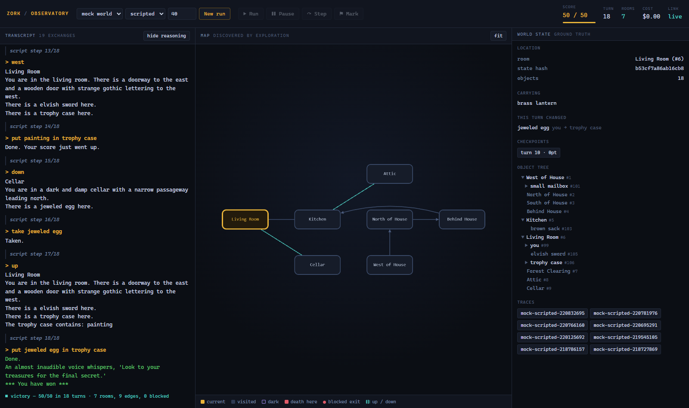

# Zork Observatory

An instrument for watching agents play interactive fiction.

The game runs unmodified. The observatory sits beside it and renders what is
normally invisible: the map being discovered turn by turn, the engine's internal
object tree changing under each command, and — when an LLM is playing — what the
model believed it was doing at the moment it acted.



## Why

Interactive fiction is an unusually good testbed for agents. The world is
symbolic, deterministic, and has ground truth: at any moment you can ask the
engine exactly where every object is. That makes claims falsifiable in a way
most agent benchmarks aren't.

The design decision that shapes everything else is that **game state is
serializable**. A playthrough isn't a line, it's a tree you can fork at any
turn — so "what if the agent had taken the lamp first" is a button, not a
rerun.

## Quick start

Real Z-machine games run through [Jericho](https://github.com/microsoft/jericho),
which wraps a modified Frotz and exposes the live object tree, `get_state` /
`set_state`, and a world-state hash. Jericho ships a compiled Frotz and is
effectively Linux-only, so the core runs in Docker.

```bash
# Put a story file in roms/ first — see below.
docker compose up --build        # → http://127.0.0.1:8000
```

Or headless:

```bash
docker build -f docker/Dockerfile -t zork-observatory .
docker run --rm -v "$PWD/roms:/app/roms:ro" zork-observatory \
  observatory play --engine jericho --rom roms/zork1.z5 --agent random --turns 150
```

### Game files

**Not included.** Zork is copyrighted by Activision and is not distributed with
this project. The research community's reference corpus is the
[Jericho game suite](https://github.com/BYU-PCCL/z-machine-games), which is what
essentially every interactive-fiction RL paper benchmarks against; drop a story
file into `roms/` and point `--rom` at it. Verified against Zork I, Release 88 /
Serial 840726 (Z-machine v3, 350 points, 246 objects).

### The mock world

`--engine mock` is a small hand-built world. It exists so the pipeline, the
trace format and the UI can be tested on any OS without a story file or Docker,
and so CI has something deterministic to run. **It is a test fixture, not a
benchmark** — no number produced against it means anything about an agent, and
findings from it must be reconfirmed on a real game. Two bugs that only surfaced
on first contact with real Zork are recorded in `jericho_engine.py` and
`discovery.py` as a reminder of exactly how much the fixture hides.

```bash
uv venv && uv pip install -e ".[dev]"
observatory play --agent scripted --turns 30   # no ROM, no API key, no Docker
pytest
```

### The walkthrough, as a reference

`--agent scripted` on a real game replays the game's own winning walkthrough,
the one Jericho ships and verifies. On Zork I it takes 396 commands to score
350/350 with no deaths, visiting 84 rooms. The replay is a ceiling to measure
against and a way to watch the whole chart uncovered. It knows everything and
discovers nothing, so treat its numbers as a reference, not a result.

The walkthrough only works under the random seed it was recorded with. Zork's
combat and thief are random, and under any other seed the same script dies in
the forest at command 34. So a scripted run always uses the recorded seed, and
its turn budget grows to fit the script. A game with no verified walkthrough is
refused rather than replayed wrong.

```bash
observatory play --engine jericho --rom roms/zork1.z5 --agent scripted
```

### Playing with Claude

```bash
export ANTHROPIC_API_KEY=sk-ant-...        # or: ant auth login
observatory play --agent claude --turns 40 --trace traces/run.jsonl
```

The agent sees the transcript and nothing else — no object tree, no valid-action
list, no walkthrough. `--effort` (default `medium`) and `--history-turns`
(default 30) are the two cost levers; both are exposed in the UI.

`--info-level` controls how much it is told before it starts, from a bare
terminal to an openly coached player:

```bash
observatory play --agent claude --info-level cold --turns 60
```

### Playing with a local model

`docker compose up` also starts [Ollama](https://ollama.com) on the GPU. Local
inference is free per token, so hundreds of runs cost electricity and nothing
else. Pull a model once; the weights live in a named volume:

```bash
docker compose exec ollama ollama pull qwen3:8b
docker compose exec observatory observatory play --engine jericho     --rom roms/zork1.z5 --agent ollama --model qwen3:8b --turns 200
```

In the browser, pick **ollama — local**; the model list is whatever the server
has pulled. A local player receives exactly the same words as Claude, since
prompts, transcript window and memory are assembled in one place
(`agents/llm.py`). The difference is the transport and three settings a hosted
API would choose for you, all recorded in the trace:

- **Context window.** Ollama's default is 4096 tokens, and it cuts an
  over-long prompt from the front without saying so. That would drop the
  system prompt and the memory first. The agent asks for 16k.
- **Sampling.** Temperature 0.7, seeded from `--seed`, so a run can be
  repeated.
- **The model itself.** A tag like `qwen3:8b` changes when the library is
  updated; the digest doesn't, so the digest goes into the trace.

`--think` (`default`, `off`, `on`, or `low`/`medium`/`high` for models that
grade it) controls whether the model reasons before answering. Tokens are
counted on every turn even though nothing is billed, because how much
inference a player needed is a measurement in its own right.

To use an Ollama installed on the host instead of the container, set
`OLLAMA_HOST=http://host.docker.internal:11434` before `docker compose up`.

### What the agent is shown, and what was tried instead

Every model player sees the same thing: the system prompt for its rung, any
lessons it has kept, and a rolling window of the last thirty exchanges
(`--history-turns`). The window is assembled in one place, `agents/llm.py`, so
a difference between two models is a difference between models.

That window is doing more work than it looks like. A room description scrolls
past once and names everything you could act on; thirty turns keeps it in view
long enough to be tried.

In September 2026 a twelve-arm sweep tested the alternative — a structured
record of what had been typed and what came back, plus scaffolds built on it
(untried directions here, the parser's vocabulary, a nudge when the model
repeated itself, a ranked-candidate filter, a journal of the world's shape
carried between runs). Every one of them made the player worse, and the record
worst of all: with it, the model never once entered the house in 350 turns.

All of it was removed. The reasoning, the numbers and the mechanism are in
[docs/experiments/2026-09-scaffold-sweep.md](docs/experiments/2026-09-scaffold-sweep.md),
and the code is recoverable at the tag `scaffolds-2026-09`. The short version:
a structured memory that **replaces** the transcript hides the descriptions
that tell a player what is in front of them. If it is worth trying again, it
belongs alongside the window, not instead of it.

### The journal: a record the player keeps on purpose

`--journal` (or the picker in the browser) adds one optional field to the
reply the agent already makes:

```json
{"reasoning": "…", "command": "open window", "journal": "The window at the back of the house opens."}
```

Whatever it puts there is kept, rendered back beside the transcript on every
later turn, and carried between runs by the notebook. It is a field rather than
a tool call on purpose: a second round trip would double a local model's
latency and go through the Ollama path that fails on gpt-oss, and as a field it
is written in the same breath as the move that caused it.

That timing is the point. The lessons in `agents/memory.py` are written at a
death, from the last twelve exchanges, capped at two sentences, in answer to
*"what do you believe you have learned"* — so a run asked at turn 200 cannot
write down what the mailbox did at turn 2, because it can no longer see turn 2.
What comes back is a theory about whatever happened last. A journal is written
while the thing it is about is still on screen.

**Only entries the world bore out are kept.** The observatory has the
Z-machine's own state on both sides of every command, and `world/outcomes.py`
already classifies each turn: `progress` means the state hash, room, score or
inventory actually differs from before. An entry offered on a `progress` turn
is kept; one offered on an `inert`, `futile` or `blocked` turn is counted,
traced and thrown away. The agent still chooses what to write and the words
stay its own — the world decides which of them last.

That is not how it was built. The first version kept everything, and the run
that measured it is the argument for the change. Over ninety-five turns a
qwen3:14b run wrote twenty-two entries, eight of them true, and the false ones
were not scattered:

```text
grating loop   turns  1–70    2/10 corroborated
break-in       turns 71–82    6/6
door loop      turns 85–93    0/5
```

Six straight true entries while it opened the window, entered the house, took
the lamp and lit it. Then five straight false ones while it pushed at a door
that does not open — including *"Moved east from Attic to Living Room"* on a
turn the exit was refused. Earlier it wrote *"took the grating"* on a turn the
engine classified `futile`, then spent forty turns trying to take the grating
it had just recorded taking.

**A model writes its most confident fiction exactly when it is stuck**, and an
unfiltered journal feeds that straight back to it as established fact.

Two further refusals, for lines that are true and still not worth carrying.
**Movement**: going somewhere is real change and passes the test above, but the
map already holds every room and passage in more detail — of the first
twenty-eight entries one run kept, sixteen were *"Moved north from the forest
path"* and its variants, crowding out the eight that said anything the map does
not. **Repetition**: the same act gets written several ways, and a model will
copy the previous line verbatim onto the next turn, so the check matches on
`(room, command)` as well as on the words with any `Turn 82:` stamp removed.
**Hedging**: a line beginning *"Attempted to…"* records only that something
was tried. A turn can change something while the thing the sentence is about
fails — that is how *"Attempted to cut the nails with the elvish sword"* became
permanent, and why the model spent two runs sawing at a door on the strength of
it. The model has its own word for not knowing whether something worked, and it
is taken at that word.

That makes three numbers where there was one, because they answer different
questions and a single figure answered none of them honestly:

```text
truthful_pct   of everything offered, how much the world bore out — counting
               the lines dropped for repetition or movement, which were true.
               Always over what was offered, never over what survived: every
               kept entry is corroborated by construction, so a rate over
               survivors would read 100% however much fiction was written.
false          claims about turns where nothing happened. The live
               stuck-detector: near zero while a run is getting somewhere,
               the bulk of the traffic once it is not.
redundant
movement
hedged         true, and dropped anyway. Not a fault in the model — the
               record refusing to fill up with what it already holds, or with
               lines that only report having had a go at something.
```

Two limitations, stated rather than buried. A turn that only reveals
information — reading a leaflet, examining a thing — changes no state, so it is
`inert` and refused however worth remembering it was. And corroboration checks
that *the turn* changed something, not that *the sentence* describes that
change: one run walked west and wrote "Took the sack from the table", which is
progress and a lie at the same time. The repetition check catches that
particular shape of it; nothing catches the general case.

`Journal(corroborated_only=False)` and `Journal(keep_movement=True)` restore
the earlier behaviours for the arms that measured them.

It is off by default, because a player that keeps no journal is the control arm
for one that does, and that is the arm the sweep actually measured. The prompt
splits along the usual line: **that** a journal exists is interface knowledge
and every rung is told it; **what to put in it** is a tactic and only `coached`
is told that. `tests/test_prompt_hygiene.py` enforces both.

## How it fits together

```text
        ┌──────────────┐
        │    Agent     │  sees only the transcript
        └──────┬───────┘
               │ command
        ┌──────▼───────┐
        │   Session    │  turn loop, map builder, object differ, checkpoints
        └──────┬───────┘
               │ events
        ┌──────▼───────┐
        │  Event bus   │──→ TraceWriter (JSONL on disk)
        └──────┬───────┘
               │
        ┌──────▼───────┐
        │   Browser    │  transcript · map · state explorer
        └──────────────┘
```

Every turn emits events; the browser is a pure consumer of that stream. Replay
pushes a recorded trace through the same bus, so a run from six months ago
renders exactly like a live one — including someone else's run, on someone
else's machine.

### The map is discovered, not seeded

Nothing is hardcoded about Zork's geography. A movement command plus the room
the player ended up in yields an edge; a movement command that *didn't* move you
yields a blocked exit, drawn as a stub with the refusal message attached. It
works on any game the engine can load.

### The shape of the map, not just its size

Room and edge counts say how much was found and nothing about how. Two runs can
find twelve rooms, one by pushing outward and one by pacing the same corridor,
and the count calls them equal. `world/frontier.py` measures the difference,
still without consulting the game: how deep the map reaches from the starting
room, how many disconnected fragments it is in, what share of room-to-room
moves landed somewhere already known, how many directions were tried per room,
how many walls were hit once and never retested — and how long the run went on
after it last found anything new.

That last one is the sharpest. In the September 2026 sweep the arm that scored
zero found its twelfth room on turn 70 and its thirteenth never, so 296 of its
350 turns were spent after the map had stopped growing. Nothing in the score
said so until the end.

These travel on every `map.update` and on `session.ended`, and show in the map
pane's header while a run is going. For traces recorded before they existed,
`tools/structure.py` rebuilds the map from the events and computes them after
the fact:

```bash
python tools/structure.py                                    # every arm, final shape
python tools/structure.py --timeline traces/sweep/bare.jsonl # one arm over its length
```

The rebuild is exact — replaying a trace reproduces the map the live run held,
across deaths and rollbacks — and a test holds it to that.

### The chart: a period map under fog

For Zork I there is a second view: the 1982 Zork Users Group map (D. Ardito
and S. Meretzky), kept dark until the run gets there. Each room the run visits
clears a ragged, soft-edged patch of fog. Each passage it walks is uncovered
along the line the cartographers inked, starting from the room it left. The current room pulses. Its recent path is drawn as
marching dashes, deaths are marked in red, and a minimap shows where the view
is looking. Drag to pan, scroll or pinch to zoom, double-click to dive in;
`+` `−` `0` `.` do the same from the keyboard. `[` `]` hide the side panes,
and `m` leaves only the map.

The chart belongs to whoever is watching. The agent never sees it.

Room boxes live in `web/atlas/zork1-r88.json`, keyed by object number, and
the atlas is matched to the game by its story header (release, serial and
checksum), not by filename. Object numbers change between releases, so a chart
measured on one release says nothing about another. Zork has four rooms called
Forest and fifteen called Maze; each was matched to its box by reading the
exit table out of the story file. Games with no matching atlas get the graph.

**The scan is not included**, for the same reason the story file isn't.
Supply your own copy and build the web image:

```bash
pip install pillow
python tools/build_atlas.py path/to/zork-1-map-ZUG-1982.jpeg          # 6517×5030
python tools/build_atlas.py path/to/scan.jpeg --check traces/check.jpg  # outline every box
```

The passages in the atlas were traced from the scan by
`tools/trace_paths.py`:

- **Which pairs to trace** comes from the exit table in the story file.
- **The route** between each pair is the cheapest one through thick ink. The
  map's passage lines are thick strokes, while its illustrations are hatched in
  thin ones.
- **Two kinds of hand correction** are recorded in the atlas:
  - `stubs` are pairs the map only marks with a "(to …)" label.
  - `drawn` are routes traced by hand where a line runs into artwork.

Room boxes, passages and corrections are all derived data, so they're
committed. Re-tracing needs Pillow, numpy and scikit-image, and only matters if
the boxes change.

### How much the agent is told is a variable, not a setting

`--info-level` is the experimental axis. Four rungs, each adding exactly one
kind of knowledge:

| Level | The agent is told |
| --- | --- |
| `cold` | It is typing at a computer terminal. That is all — not that it's a game, not that a parser exists. |
| `game` | It is a game and it should do well at it. Nothing about how to operate it. |
| `parser` | The interface: grammar, direction words, `look`, `inventory`. **Default.** |
| `coached` | Hazards and tactics. Deliberately contaminated — the control arm. |

Running one model across all four produces a score-versus-scaffolding curve,
and the shape of that curve says more than any single number.

Every level below `coached` obeys one rule: **describe the interface, never the
world.** No object names, no hazard warnings, no tactics. The moment a prompt
says "darkness is lethal" or names a mailbox, the score measures the prompt as
much as the player. `tests/test_prompt_hygiene.py` enforces this on every rung
(and checks that `coached` really *is* contaminated — a control arm that isn't
measures nothing). `Agent.describe()` writes the verbatim prompt and its
fingerprint into every trace, so a published run is auditable by someone who
wasn't there.

One caveat, stated plainly because it's easy to forget once numbers look good:
**`cold` does not produce a naive player.** The model has read thousands of IF
transcripts. What the ladder measures is how much scaffolding a model needs
before it deploys knowledge it already has — worth measuring, but not the same
as watching something meet the form for the first time. Getting closer to that
requires perturbing the world too: "an open field west of a white house" is a
fingerprint no amount of prompt austerity can hide. See the mutator below.

### Coverage, with real denominators

"Twelve rooms" is an achievement in one game and a rounding error in another.
The object table knows which, so the denominators come from ground truth:

```text
explored: 12/109 rooms (11.0%) · 7/136 objects seen (5.1%)
          0 ever held, 3 stowed · score 0/350 (0.0%)
```

Both denominators are derived structurally, with no per-game knowledge. **Rooms
are the siblings of the room you are standing in** — every Z-machine game hangs
its rooms off one parent object, so the starting room identifies all 109 of
Zork's on turn one, before the agent has found any of them. **Objects** are
everything named that is neither a room nor the player.

Identifying the player is the fiddly part, and it is done two ways because
neither alone is enough. Carried items point at their owner, but that only
works once something has been picked up, and you start empty-handed — leaving
the player counted as an object it had "discovered" and coverage reading 112%.
So the fallback is that **the player is the thing that changes rooms when you
do**: intersect the contents of each new room across moves and exactly one
object survives. That converges on the first move.

`stowed` is the generic form of "treasures in the case" — anything put inside a
container that is neither a room nor the player. In Zork the score is the
authoritative treasure metric, and it is reported alongside.

### The discovery ledger

The puzzles are not the interesting part. Before any of them there is a quieter
sequence — *oh, it understands directions* — *oh, the rooms are still there when
I come back* — *oh, things can be inside other things*. That is an ontology
being built from raw interaction, and every player ends up with the same one.

The ledger records the first turn each realisation becomes **observable in
behaviour** — not what the agent claims to have learned:

```text
 3  Movement exists          Typed words can change where you are.
 ·  Directions abbreviate    The parser accepts shorthand.
 9  The world persists       Places still exist when you leave them.
 7  Objects can be carried   The world can be picked up, not only walked through.
 1  Things can be opened     Some objects have an interior state.
 7  Objects contain objects  The world is a tree, not a flat list.
 ·  Darkness exists          Some places cannot be perceived at all.
 ·  Death exists             Actions can end the run. The world is not safe.
```

Two things make this worth more than a score. **It works on failure** — an agent
that dies on turn 30 having never discovered containers has told you something
specific, where "score: 0" told you nothing. And **it is comparable across
games**, where rooms and treasures are not.

Detectors are deliberately conservative and use world-state changes wherever
possible: a false discovery silently corrupts the number the whole experiment
reports, so when in doubt they don't fire.

### The baseline has to be ignorant too

The same rule that governs prompts governs the random agent. Its first version
sampled from a list I wrote containing `open mailbox` and `take lamp` — so it
could "discover" containers by luck, because I'd told it a mailbox existed.
That's the prompt-contamination bug in a different file.

It now harvests nouns from the text the game has actually printed, and combines
them with generic English verbs. Its vocabulary grows exactly as fast as its
exposure does, and pointing it at a different story file leaves it equally
ignorant — which is what makes it a floor rather than a sandbagged one.

`--valid-actions` makes it sample from the engine's own valid-move set instead.
That is a *much stronger* baseline — an oracle listing every move that would
change the world. Useful as a ceiling for random play; never report it as the
floor.

### There is no turn limit, only a budget

Zork has no turn limit. It has a lamp that runs down and a world that kills you,
and those are the real constraints. `--turns` exists to stop a runaway loop
spending money, and a run that hits it is reported as **censored**:

```text
=== turn budget exhausted — score 0/50 in 150 turns, 1 death(s) ===
    [CENSORED: stopped by the harness, not the game]
```

This matters more than it looks. An agent that hadn't discovered containers by
turn 150 has not *failed* to discover them — it ran out of budget. Those are
right-censored observations, and treating them as outcomes would corrupt every
time-to-discovery statistic the ledger produces. `--max-cost` is the other
budget, and usually the one that actually binds.

Relatedly, discoveries are timestamped in **steps**, not turns. A death rolls
the turn counter back; steps only ever go up. Time-to-discovery measured in
turns would silently under-report every run that died, which is the interesting
case.

### Death, saves, and the one thing that carries over

A human played Zork with a save file. Die, restore, try something else — and
crucially, the world goes back but *you* don't. You lost the lamp and the twelve
points and you kept the sentence that matters: don't go down there without a
light.

```bash
observatory play --agent claude --lives 3 --turns 400
```

- `--lives N` — how many times the world may be rolled back after a death.
  Default 0, ironman.
- The agent can also type `SAVE` and `RESTORE` itself. These are intercepted
  before the parser sees them (a real Z-machine prompts for a filename, which
  would deadlock a loop that sends one line per turn) and are backed by the same
  snapshot machinery as branching. `--no-agent-save` withholds them.
- On death the agent is asked one question — what it believes happened and what
  it intends to do differently — and whatever it writes is kept. **That memory
  survives every rollback for the rest of the run.** Nothing else does.

The rollback deliberately steps back a margin rather than to the newest
checkpoint. Checkpoints land on a timer, so the most recent one is often *inside*
the thing that just killed you — restore there and the run burns every life in
four turns without ever acting on what it learned. An agent's own `SAVE` is
never second-guessed.

The memory is a belief, not a fact. An agent can draw the wrong lesson and carry
it for the rest of the run, and reading a confidently wrong memory against the
object tree is more interesting than reading a right one. Lessons are the
agent's own words, verbatim, and they travel in the trace — so comparing what
different models wrote down after dying in the same place is a real artifact in
a way comparing two scorelines never is.

### Runs in a series, and the notebook

A run that ends (budget, death, or victory) can be followed by another that
starts from the first move with a fresh agent. The only thing carried across
is the agent's notebook:

```bash
observatory play ... --agent ollama --model qwen3:8b --runs 5 --notebook new
```

- `--notebook carry` continues the notebook for this player and game, stored at
  `traces/notebooks/<story>/<player>.json`. `new` sets the existing notebook
  aside (it is renamed, never deleted) and starts another. `off`, the default,
  carries nothing.
- At the end of each run the agent is asked for at most two sentences to a
  future self who "will start again from the very beginning". The question is
  the same whatever ended the run. Death notes from within a run go into the
  notebook too.
- The notebook is keyed by the full player name (model and information level),
  so notes written under a coached prompt never reach an uncoached player.
- It records every run's result, so it reads as a lineage: what each run
  believed and how far it got.

In the browser the same options are the **runs** and **notebook** selectors.
Chained runs start on their own after a two-second pause.

### Rewinding doesn't erase knowledge

`Session.rewind()` restores the world to a checkpoint but leaves the map intact.
The world forgets; the observatory doesn't. That asymmetry is what lets you
explore counterfactual branches without losing what you learned in them.

Checkpoints are taken automatically every 10 turns as well as on demand, because
you rarely know a turn mattered until later — by the time a run walks into a dark
room and dies, the decision worth re-running was twenty turns back.

## Traces

A trace is JSONL, one event per line:

```json
{"kind":"trace.header","version":1,"game":"zork1","agent":"claude:claude-opus-5"}
{"kind":"event","seq":12,"type":"command.issued","payload":{"turn":4,"command":"open mailbox"}}
{"kind":"event","seq":13,"type":"observation","payload":{"text":"Opening the small mailbox reveals a leaflet.","score":0}}
```

```bash
observatory replay traces/run.jsonl     # terminal
# or load it from the Traces menu in the browser
```

## Layout

```text
src/observatory/
  engine/       backends: jericho (real games) · mock (tests, no ROM)
  world/        map graph built from observed transitions · frontier.py (its shape)
                · object-tree diffing
  agents/       random · scripted · human · claude · ollama · llm.py (what every model is shown)
                · memory.py (the lessons an agent keeps at a death)
                · journal.py (what it writes down as it plays)
  session.py    the turn loop and the checkpoint stack
  notebook.py   what crosses from one run to the next
  events.py     the event bus
  trace.py      JSONL read/write
  server.py     FastAPI + WebSocket
  web/          the front end · atlas.js (the chart) · atlas/ (room boxes)
tools/
  build_atlas.py  scan → web image, plus a calibration overlay
  trace_paths.py  exit table + scan → the inked passage between each pair of rooms
  sweep.sh        one configuration at a time, because there is one GPU
  summarize_sweep.py · sweep_status.py   the sweep read back, finished or live
  structure.py    the shape of the map a trace drew, rebuilt from its events
docs/experiments/  what was measured, and what was removed because of it
```

## Roadmap

The instrument is the foundation. What it's for:

- **The mutator** — rename objects, shuffle exits, relocate treasures, reseed
  randomness, then score the same model on canonical vs. mutated worlds. The
  delta separates reasoning from memorized walkthroughs. This is the one that
  makes `--info-level cold` mean something, and it's next.
- **Trajectory tree** — every run overlaid, branch points marked, dead branches
  ending in deaths. The map view is one projection of it; the checkpoint stack
  already holds the data.
- **Belief vs. ground truth** — have the agent maintain an explicit notebook —
  its map, its inventory beliefs, its hypotheses — and render that *beside* the
  object tree rather than instead of it. The discrepancies are the experiment:
  rooms it thinks are distinct that are the same place, exits it invented,
  objects it believes it dropped. Map fidelity over turns as a metric.
- **Populations** — N agents from an identical cold start, comparing the
  *distribution* of discovery steps rather than single runs. Time-to-first-
  container, time-to-first-death, vocabulary breadth probed. Failure is data,
  and censored runs are handled as censored.
- **Memory archaeology** — diff what different models wrote down after dying in
  the same room. Which ones blamed the right thing? Which carried a wrong
  lesson for two hundred turns? The lessons are already recorded verbatim in
  every trace; this is the analysis pass over them.
- **Tournament mode** — interleaved agents in one world via snapshot/restore,
  plus a shared message channel.
- **First-person** — one cached still per room, keyed to room and lighting,
  rendered from the trace.

## License

MIT. Game files are not included and are not MIT.
